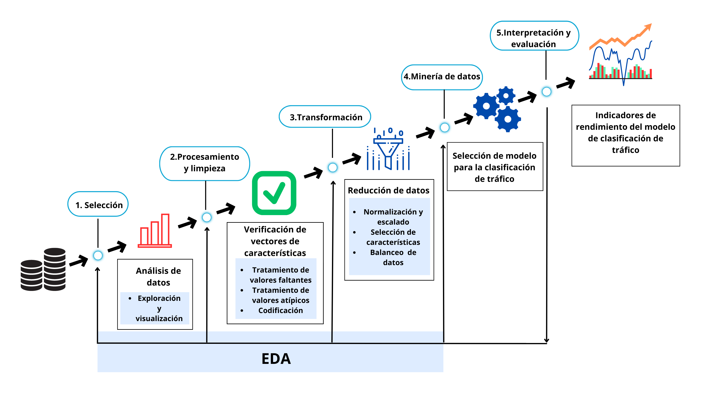

# Introducción
En este repositorio se encuentra diferentes scripts desarrollados para obtener modelos de aprendizaje automático (ML) con el fin de clasificar ataques en Redes Definidas por Software.

# Contenido
Para el proyecto desarrollado, se utiliza las metodologías KDD (Knowledge Discovery in Databases) que contiene cinco fases y EDA (Exploratory Data Analysis). Sin embargo, en este repositorio constan cuatro fases y la quinta se encuentra en el repositorio [app_sdn](https://github.com/Mianca05/app_sdn), el cual es la fase de despliegue. La siguiente imagen muestra la aplicación de estas metodologías:

*Nota*: Metodología KDD para obtener modelos de ML y  EDA para la exploración, limpieza y transformación de datos.

A continuación, se describe las principales actividades en cada una de las fases:
## Fase 1: comprensión de datos.
Se realiza la selección de datos a partir de un conjunto de datos público.  Las actividades realizadas fueron: 
* Seleccionar los datos apropiados previamente obtenidos de un procesador de flujos de tráfico IP.
* Analizar las características.
* Comprender los tipos de datos del dataset.
## Fase 2: Procesamiento de datos
Se lleva a cabo el tratamiento de outliers, inliers. También, se codifican y se transforman nuevos valores para los vectores de características.
## Fase 3: Transformación de datos
Se aplican técnicas para balancear datos, normalizarlos e identificar y seleccionar grupos de características para utilizarlos en los modelos de ML.
## Fase 4: Selección de técnicas de ML
Se utilizan las técnicas Decision Tree, SVM y Random Forest, debido a que anteriormente fueron seleccionadas bajo una revisión sistemática de literatura (RSL) conjuntamente con un análisis basado en la búsqueda de sus hiperparámetros para la configuración de estos modelos.

## Librerías utilizadas
* Numpy
* Pandas
* Matplotlib
* Seaborn
* Sklearn (utils, preprocessing, model_selection, decomposition, compose, feature_selection, impute, missingno, ensemble, metrics, svm, tree, time)
